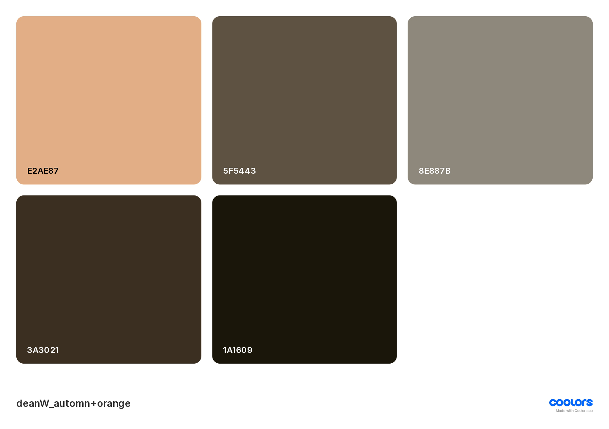
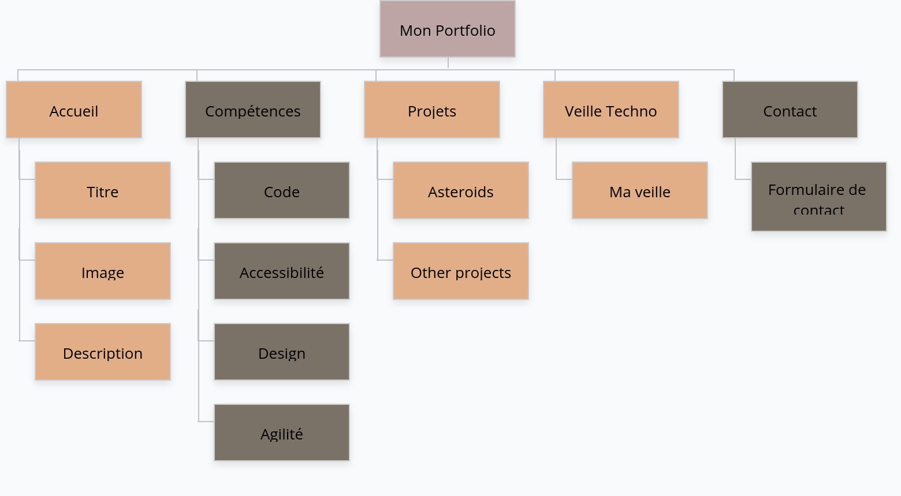

# Etapes de réalisation de mon Protfolio

## Identité Visuelle
### Choix de la charte graphique

Pour ça: J'ai pris une photo issue de l'épisode <b>"Blood Lust"</b> de la saison 2 de la série <b>"Supernatural"</b>, montrant Dean Winchester.
Puis, grâce au site [Coolors](https://coolors.co/221d23-4f3824-d1603d-ddb967-d0e37f), on obtient cette palette de couleur d'automne:


### Mon Favicon:
 Sur le site [favicon.io](https://favicon.io/), j'ai créé cette icône avec mes initiales pour l'utiliser comme favicon,la voici:
 
 

 ### Mes icônes:
 Pour les icônes je suis restée sur le thème de l'image, à savoir des icônes plutôt retro, prises sur le site [FontAwsome](https://fontawesome.com/).
 * <b>Utiliser une icone dans html:</b> <i>How to</i>:

J'étais partie sur une bibliothèque d'icones de flaticons, avant de partir sur fontAwesome, qui est plus simple et facile à utiliser   
Les étapes, c'est:

Copie dans le head cette ligne de code:
```html
    <link rel="stylesheet" href="https://cdnjs.cloudflare.com/ajax/libs/font-awesome/6.4.2/css/all.min.css">

```

Puis pour chaque icone utilisée, dans une balise i, ou span , on met son code 
```html
 <i class="fa-solid fa-house"alt="icone maison"></i> 
 
 ```

 ### Ma maquette:
Sur figma, j'ai fait la maquette de ce que je veux avoir comme résultat. <!--Ajouter les images de la maquette, donc il faut la finir Habibi -->

### Schéma Relationnel:
 Réalisé sur [GlooMaps](https://www.gloomaps.com/)


